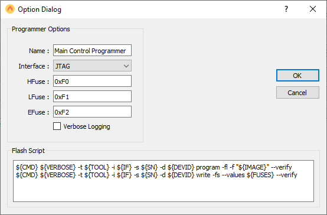

# README

## Overview

This repository contains the source-code and documentation for the `Wunder-Bar Atmel Multi-Programmer` which can program up to three Atmel chips simultaneously. This requires three `AtmelICE` JTAG programmers connected via USB to the host system.

### Features

* Can program all three firmwares simultaneously.
* Firmware setup is persistent (no need to configure every time).
* Uses the Atmel Studio's `atprogram.exe` tool to perform programming.

## Configuration JSON

Here is a sample configuration JSON file:

```json
{
    "programmer1" : {
        "name" : "Main Control Programmer",
        "tool" : "atmelice",
        "fw" : "C:\\Users\\muman\\Project\\ATMEL\\ATMEL\\Atmel_Single Board\\Main RsdMc_E14A\\RSDMC_E14A.hex",
        "sn" : "J41800081492",
        "if" : "JTAG",
        "device": "atmega162",
        "verbose" : false,
        "script" : [
            "${CMD} ${VERBOSE} -t ${TOOL} -i ${IF} -s ${SN} -d ${DEVID} program -fl -f ${IMAGE} --verify",
            "${CMD} ${VERBOSE} -t ${TOOL} -i ${IF} -s ${SN} -d ${DEVID} write -fu --values ${FUSES} --verify"
        ]
    },
    "programmer2": {
        "name" : "Table Programmer",
        "tool" : "atmelice",
        "fw" : "C:\\Users\\muman\\Project\\ATMEL\\ATMEL\\Atmel_Single Board\\Table Rev_B00_D\\RSDTB_PgmB00_D.hex",
        "sn" : "J42700010870",
        "if" : "JTAG",
        "device": "atmega162",
        "verbose" : false,
        "script" : [
            "${CMD} ${VERBOSE} -t ${TOOL} -i ${IF} -s ${SN} -d ${DEVID} program -fl -f ${IMAGE} --verify",
            "${CMD} ${VERBOSE} -t ${TOOL} -i ${IF} -s ${SN} -d ${DEVID} write -fu --values ${FUSES} --verify"
        ]
    },
    "programmer3": {
        "name" : "Pump Programmer",
        "tool" : "atmelice",
        "fw" : "C:\\Users\\muman\\Project\\ATMEL\\ATMEL\\Atmel_Single Board\\Pump Rev_B03_D\\RSDPM_PgmB03_D.hex",
        "sn" : "J42700010751",
        "if" : "JTAG",
        "device": "atmega1280",
        "verbose" : false,
        "script" : [
            "${CMD} ${VERBOSE} -t ${TOOL} -i ${IF} -s ${SN} -d ${DEVID} program -fl -f ${IMAGE} --verify",
            "${CMD} ${VERBOSE} -t ${TOOL} -i ${IF} -s ${SN} -d ${DEVID} write -fu --values ${FUSES} --verify"
        ]
    }
}
```

### Flash Script Variables

Several variables are replaced in the flash script when encountered.

| Variable | Meaning |
| -------- | ------- |
| `${CMD}` | atprogram.exe. |
| `${VERBOSE}` | Verbose setting from option dialog. |
| `${TOOL}` | atprogram.exe -t tool option (*`atmelice`*). |
| `${IF}` | atprogram.exe -i interface option from option dialog. |
| `${SN}` | atprogram.exe -s serial # of atmelice programmer.
| `${DEVID}` | atprogram.exe -d device identifier. |
| `${IMAGE}` | Image file (`.hex`) to program flash with. |
| `${FUSES}` | atprogram -fu --values fuse setting (l-h-e). |
## Screenshots

### Main Window

The main window looks like this:


### Options Dialog

When the user hits the `Options` button the following dialog is displayed:

