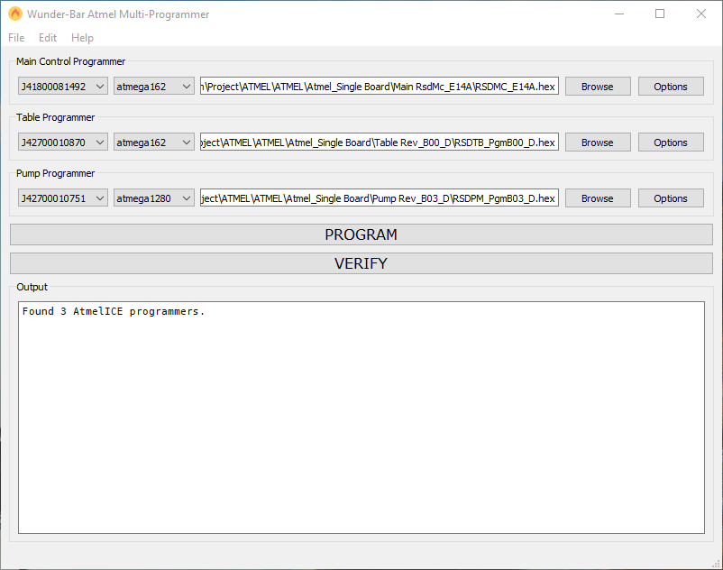

# README

## Overview

This repository contains the source-code and documentation for the `Wunder-Bar Atmel Multi-Programmer` which can program up to three Atmel chips simultaneously. This requires three `AtmelICE` JTAG programmers connected via USB to the host system.

### Features

* Can program all three firmwares simultaneously.
* Firmware setup is persistent (no need to configure every time).
* Uses the Atmel Studio's `atprogram.exe` tool to perform programming.

## Screenshot

